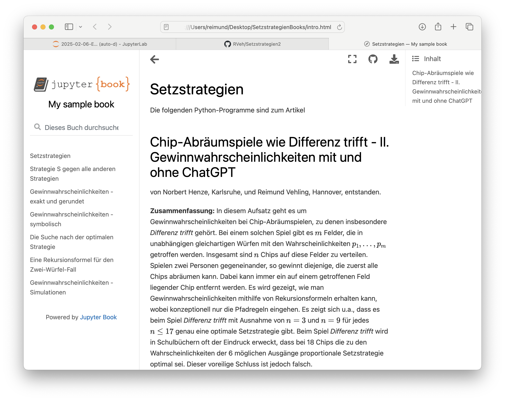

Die Dateien können auch heruntergeladen werden. Um mit den Python-Programmen zu arbeiten, wird JupyterLab benötigt.

Ohne Installation des Programms können auch sämtliche Programme im Browser gestartet werden. Der Link lautet:
https://mybinder.org/v2/gh/RVeh/Setzstrategien2/HEAD

Die Dateien mit Erläuterungen können auch im zugehörigen Jupyter-Book betrachter werden. 
Hierfür muss die Datei *SetzstrategienBooks.zip* heruntergeladen und entpackt werden. Danach die Datei **index.html** auswählen. 

